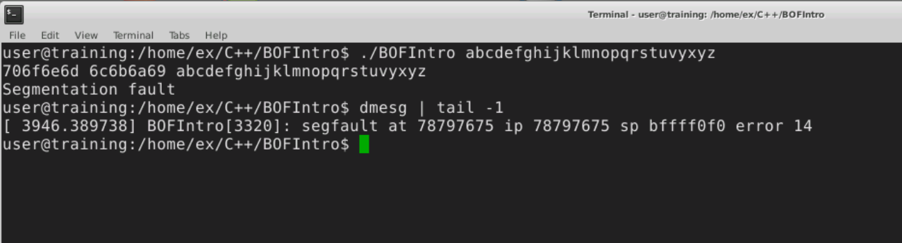
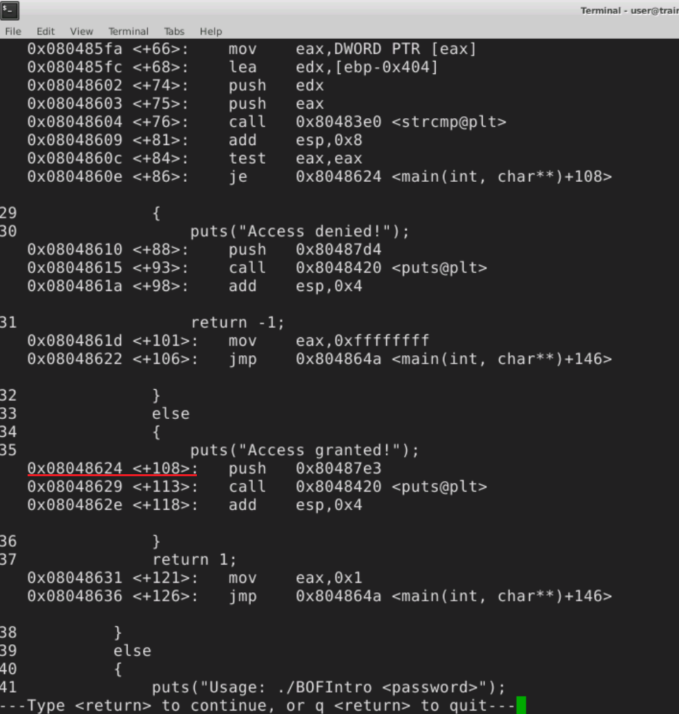

## Buffer overflow Excercise01

### Some GDB commands
- **list**: show source file line, e.g.: `list main.cpp:16`
- **disassemble**: show assembly translation of the source code, e.g.: `disassemble /m <function>` (/m: show source lines from higher level source code)
- **set args**: set command line arguments passed to the debugged application every time when it is ran, e.g.: `set args test_file.txt`
- **info registers**: display the contents of the general purpose processor registers info registers, `info registers`
- **x/**: dump memory content, e.g.: `x/12x $esp`
    - 12: repeat count
    - x: format
    - the parameter is address or variable name 
    - can change unit size, b: byte, w: word

### Action

The source code has the following function:
```c
void function(char* input)
{
    int i = 1;
    int j = 2;
    char buffer[8];
    strcpy(buffer, input);
    printf("%x %x %s\n", i, j, buffer);
}
```
If this function is called with a string (char array) larger than 8 bytes the _strcpy()_ will copy it until the \0 character and will cause a **buffer overflow**.




Things to note:
- The program was ran with the characters of the abc as input, so the values that overwrite the memory will be the ASCII code of the characters.
- From the print in the function it is visible that the _i_ and _j_ variables are overwritten when copying the too large _input_ into _buffer_. In the code they are in front of _buffer_ so they were allocated earlier on the stack -  buffer was allocated on top of them. (The stack grows from larger addresses to smaller ones.)
- The **dmesg** command prints the message buffer of the kernel, here it can be seen that it shows where the segfault happened. The return address also got overwritten so when the the function returns and the processor wants to continue the execution on the corrupted return address the program segfaults. From the address where it was trying to execute an instruction is 0x78797675, which shows (considering little endian order) the the part of the input that was overwriting the return address was: **uvyx**.

If we put a correct address in the place of the "uvyx" part of the input we can force the processor to continue the execution with an instruction at that address.

For example we can check with gdb the address of an instruction in the programs code and jump there. Like below we can put the address 0x0804824 at the position of "uvyx" the overwrite the return address and jump to the "Access granted!" part of the code. In bash values can be easily defined like this:<br>
`...rst$'\x24\x86\x04\x08'`

